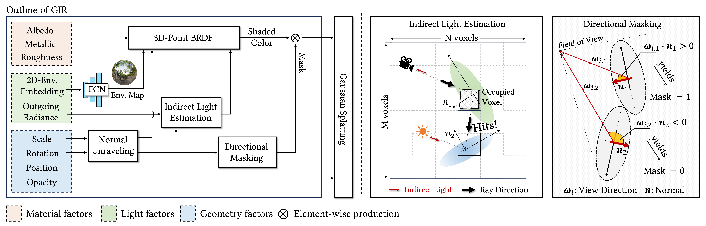

# GIR: 3D Gaussian Inverse Rendering for Relightable Scene Factorization
### [[Project]](https://3dgir.github.io/) [[Paper]](https://arxiv.org/abs/2312.05133) 

> [**GIR: 3D Gaussian Inverse Rendering for Relightable Scene Factorization**](https://arxiv.org/pdf/2312.05133),            

**Official implementation of "GIR: 3D Gaussian Inverse Rendering for Relightable Scene Factorization".** 

## 🛠️ Pipeline

  

 

## Get started

Code Coming Soon~
